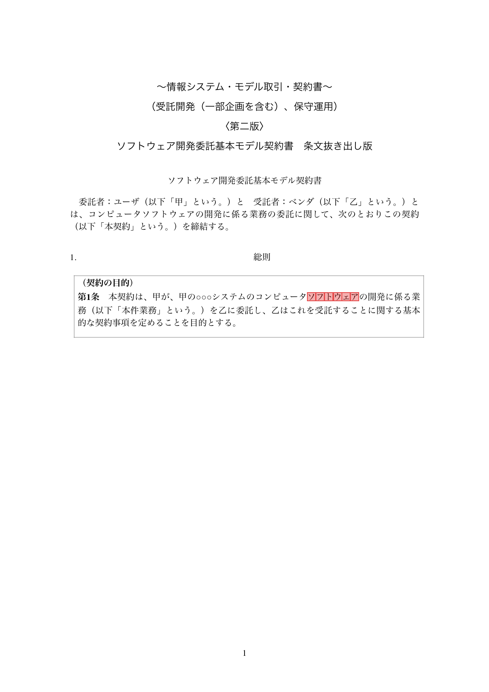
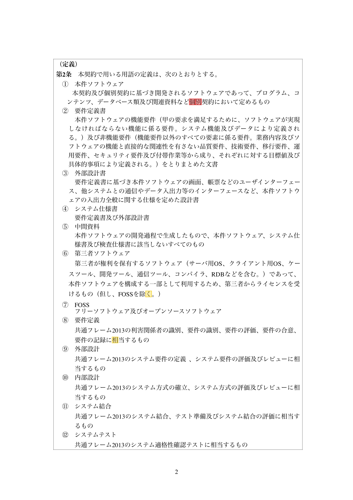
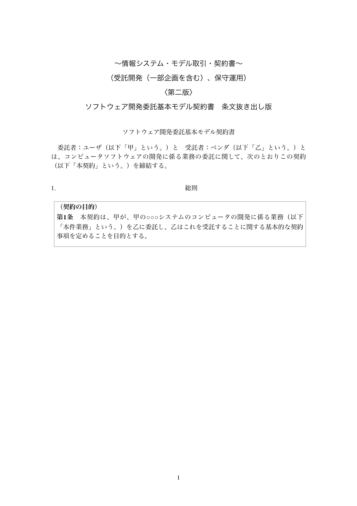
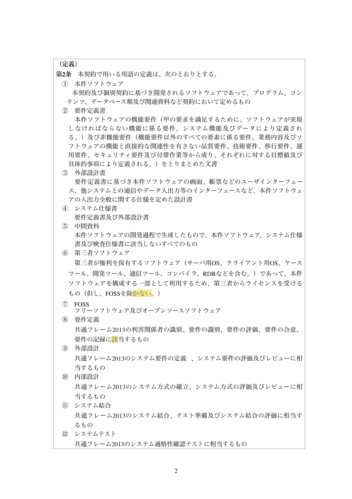

# 📄 Document Diff Tool

A web-based tool for comparing PDF documents, detecting differences, and visualizing changes with highlighted outputs.

> Note: This tool works best with digitally generated PDFs. Performance on scanned documents may be limited due to OCR accuracy.

---

## 🚀 Overview

This project provides an end-to-end solution for document comparison:

1. Upload two PDF files
2. Extract text content
3. Detect differences (line & word level)
4. Generate highlighted images
5. Export change summaries as CSV
6. (Optional) Annotate differences using LLM

---

## 🖥 Demo Features

### Diff Result
<p align="center">
  
  
</p>
<p align="center">Before</p>

<p align="center">
  
  
</p>
<p align="center">After</p>

- 📂 Upload two PDF files
- 🔍 Detect inserted / deleted / modified text
- 🖼 Visualize differences with highlighted images
- 📊 Export results as CSV
- 🤖 Optional AI-based explanation (Ollama / Gemma3)

---

## 🧱 Tech Stack

### Backend
- Python
- FastAPI
- PDF processing (custom pipeline)

### Frontend
- HTML / CSS / JavaScript (Vanilla)

### Other
- File handling & image rendering
- Optional LLM integration (Ollama)

---

## 📁 Project Structure

```bash
doc-diff-tool/
├─ app/                # Backend (FastAPI)
│  ├─ main.py
│  ├─ routers/         # API routes
│  └─ services/        # Core logic
├─ upload/            # Uploaded PDFs
├─ outputs/            # Generated results (images, CSV)
├─ frontend/           # Frontend (static)
│  ├─ index.html
│  ├─ script.js
│  └─ style.css
```

---

## ⚙️ Setup

### 1. Clone repository

```bash
git clone https://github.com/YOUR_USERNAME/doc-diff-tool.git
cd doc-diff-tool
```


### 2. Backend setup
```bash
python -m venv .venv
source .venv/bin/activate  # Mac/Linux
pip install -r requirements.txt
```

### 3. Run backend
```bash
fastapi dev app/main.py
```
Backend runs at:
http://127.0.0.1:8000


### 4. Run frontend
```bash
cd frontend
python -m http.server 5500
```
Then open in your browser:
http://127.0.0.1:5500/index.html


---

## 🔌 API
### POST `/compare/`

Upload two PDF files and get comparison results.

Request
- `old_file`: PDF
- `new_file`: PDF

Response
```json
{
  "diff_count": 4,
  "csv_url": "/static/result.csv",
  "highlight_urls": {
    "before": [...],
    "after": [...]
  }
}
```
---

## 🧠 Key Design Points
- Modular architecture (services / routers separation)
- Optional LLM integration (decoupled design)
- Static file serving for generated outputs
- Frontend-backend separation

---

## 📌 Future Improvements
- UI/UX improvements (better visualization)
- Side-by-side comparison view
- Real-time diff preview
- Cloud deployment
- Authentication & file management

---

## 📝 Author
- CHEN WANG
- Applied Mathematics & Modeling @ Meiji University
- LinkedIn: www.linkedin.com/in/chen-wang-83148b354
